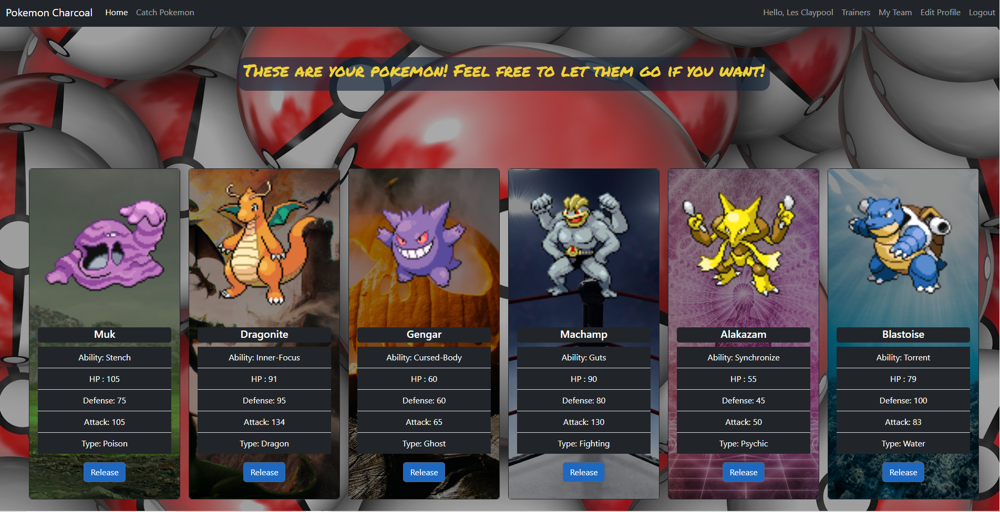

# Pokemon Charcoal

This web app allows a user to sign up, catch 6 pokemon and battle them agaisnt other users.

## Features

- **Authentication** Users can create an account, which allows them to save pokemon to their team
- **Full CRUD operations** Add up to 6 pokemon to your team, if you dont like one release it and choose another!
- **Dynamic routing** This app uses dynamic routing to allow users to navigate between pages and perform various actions
- **Battle mechanics** Users can battle agains other users pokemon teams to see who has the stronger team!
- **Dynamic background image based on pokemon type** each pokemon type has its own background image depicting that type.

## Tech Stack
- Python
- Flask
- HTML
- CSS
- Bootstrap

## Contact

Feel free to connect with me for any questions, feedback, or collaboration opprotunities

- [Email](mailto:johnclapper89@gmail.com)
- [LinkedIn](https://www.linkedin.com/in/john-clapper-476069192)
- [GitHub](https://github.com/britzky)
